Oi! Sou o Pedro, estudante de **Engenharia de Software** na UNINTER, em Boa Vista (RR). Estou construindo minha base em programação com Python, SQL e desenvolvimento web, e meu objetivo é começar como **desenvolvedor júnior**.

Também tenho experiência de campo como **eletricista na rede de distribuição de energia** (NR-10 e NR-35). Foi lá que aprendi a seguir procedimento à risca, levar segurança a sério e resolver problema com o cliente esperando. É com essa mesma disciplina que estudo: um pouco todo dia, com o progresso registrado aqui.

No futuro, quero juntar as duas coisas e trabalhar com software para energia e automação industrial.

### O que estou estudando

Além disso: SQL, redes de computadores, noções de Excel e Power BI, e inglês todos os dias.

### Trilha

- [x] Python: introdução e intermediário (DataCamp)
- [x] SQL: introdução (DataCamp)
- [x] Git: introdução (DataCamp)
- [x] Automação de Sistemas (IFRS)
- [ ] Redes, na Cisco Networking Academy (em andamento)
- [ ] Fundamentos de TI: hardware e software, na Fundação Bradesco (em andamento)
- [ ] Publicar meus primeiros projetos aqui
- [ ] Primeira vaga em tecnologia

### Projetos

**Pré-Cálculo Interativo**: site de estudos com 7 módulos (domínio, funções compostas, funções exponenciais e mais), com explicações e videoaulas em português. Em construção. Em breve no GitHub Pages.

<!-- Quando publicar, troque "Em construção. Em breve no GitHub Pages." pelo link do site ou do repositório. -->

### Contato

Estou aberto a oportunidades de estágio, suporte de TI e desenvolvimento júnior.

English version

Hi! I'm Pedro, a Software Engineering student from Boa Vista, Brazil. I'm building my programming foundation with Python, SQL and web development, and I'm looking for my first role in tech.

I also have field experience as an electrician on the power distribution grid. That work taught me to follow procedures carefully, take safety seriously and solve problems under pressure. In the long run, I want to build software for the energy and industrial automation sectors.

**Open to:** internships, IT support and junior developer roles.

